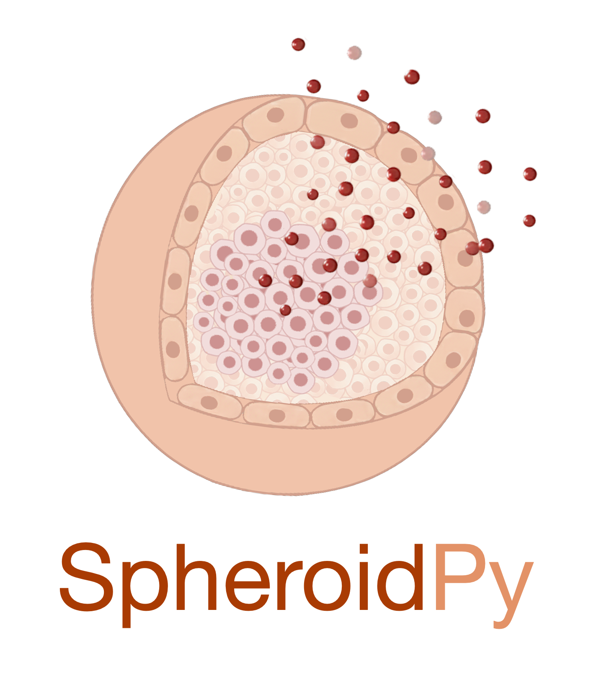

# SpheroidPy
[](https://badge.fury.io/py/SpheroidPy)
[](https://www.gnu.org/licenses/gpl-3.0)

## Overview




`SpheroidPy` is a Python package designed for the management and analysis of _in-vitro_ spheroid data. 
It offers a framework to facilitate the handling, segmentation, and analysis of extensive collections of spheroid microscopy images. 
Furthermore, it enables users to extract spatial and temporal features gaining insights into the dynamics of underlying biological processes.
While primarily developed and optimized for cancer spheroid proliferation and cytotoxicity assays, it can be adapted to other cell entities and three-dimensional assay systems.

## Applications

### Proliferation Assays


Proliferation assays are essential for studying growth kinetics in three-dimensional spheroid cultures. Besides simple growth curves, more complex behaviors - such as the emergence of a necrotic core at a critical radius $R_c$ or saturation at large sizes - can be assessed from such data.
`SpheroidPy` facilitates data import, spheroid segmentation, and comprehensive analysis of growth dynamics, including automated statistical evaluations.


## Prerequisits

To ensure a clean and reproducible setup, we recommend installing the package inside a dedicated Conda environment. Begin by installing [Anaconda](https://www.anaconda.com/products/distribution), then create and activate a new environment using the commands below. This can be done in a Anaconda Prompt (Windows) or Terminal (Mac/Linux) and guarantees that all dependencies—including optional deep-learning frameworks—are isolated from your system installation.

```bash 
conda create -n spheroidpy python=3.10
conda activate spheroid
```

Optionally, Jupyter Notebook can be installed if not already available:

```bash 
conda install jupyter
```

## Installation

#### Using PyPI
SpheroidPy is available on [PyPI](https://pypi.org/project/SpheroidPy/) and can be installed using the following command
```bash
pip install SpheroidPy
```

#### From Source
Alternatively, the package can be installed directly from source. Therefore, the repository has to be downloaded. 
After navigating to the folder containing package, it can be installed using

```bash
cd path/to/SpheroidPy             # navigate to the parent folder
pip install .                     # install the package
```

## Usage
After installation, SpheroidPy can be used to analyze spheroid microscopy data following a hierarchical workflow from single images to full experiments.

At the core, individual microscopy images are represented by `SpheroidImage` objects, which provide functionality for segmentation and feature extraction:
```python 
from SpheroidPy.spheroid import SpheroidImage

spheroid = SpheroidImage(
    brightfield='path/to/image.tif',
    image_size=(1700, 1270)
)

spheroid.segmentation()
radius = spheroid.radius
```

Time-resolved measurements of the same spheroid can be organized in a `SpheroidSeries`, enabling the analysis of temporal dynamics:
```python 
from SpheroidPy.spheroid import SpheroidSeries

series = SpheroidSeries("Example")
series.add_spheroid_image(spheroid, timestamp)
series.segmentation()

series.metric('radius', plot=True)
```

Multiple series (e.g., technical replicates) can be combined in a `SpheroidCollection` for statistical evaluation:
```python 
from SpheroidPy.spheroid import SpheroidCollection

collection = SpheroidCollection("Collection", [series])
collection.metric('radius', mean=True)
```

For structured comparison across experimental conditions, collections can be grouped in a Result:
```python 
from SpheroidPy.experiment import Result

result = Result("Experiment", condition="concentration")
result.add_collection(collection, condition=0)
```

At the highest level, complete workflows can be organized and persisted using the Experiment class:
```python 
from SpheroidPy import Experiment

experiment = Experiment(name="MyExperiment", path="path/to/project")
```

For high-throughput live-cell imaging experiments, dedicated `LiveCellReplicate` and `Platemap` classes enable structured handling of microwell plate layouts, automated image assignment, and condition-based grouping of wells:
```python 
replicate = result.replicate('Replicate1', layout=96)
replicate.platemap.cell_line('CellLineA', {'B2:G3':0, 'B4:G5':10})

replicate.load_images('path/to/data', ['PhaseContrast'], ['green'], ['red'],
                      image_size=(1700,1270))
```

Overall, SpheroidPy enables a consistent transition from single-image analysis to large-scale, reproducible experiments within a unified framework.
