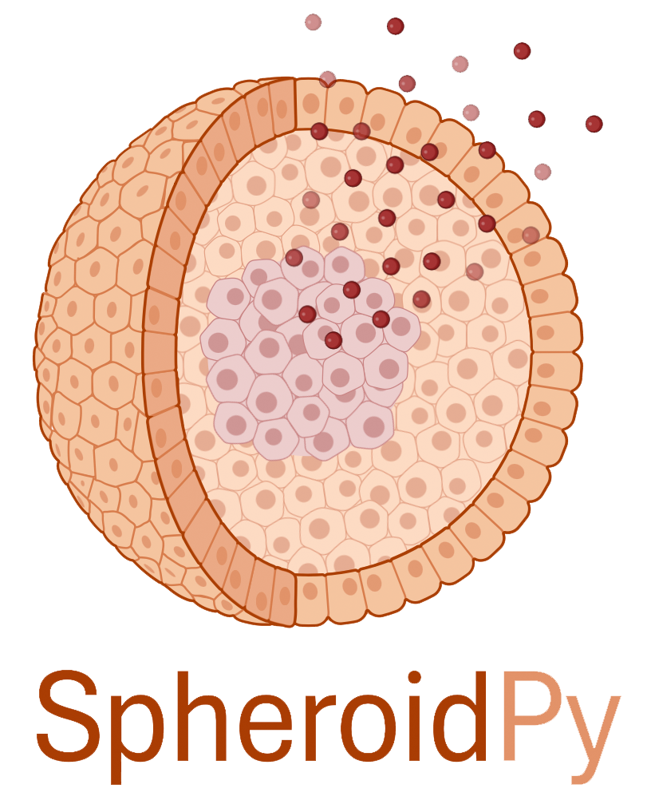
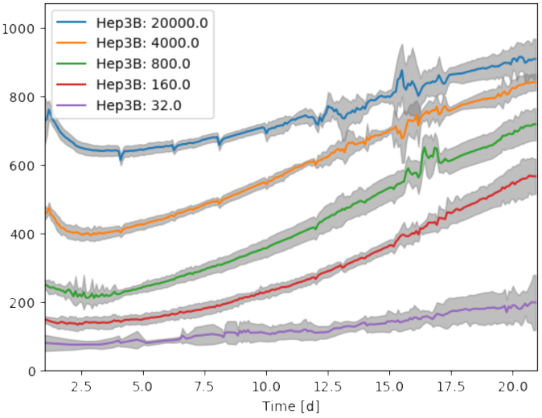
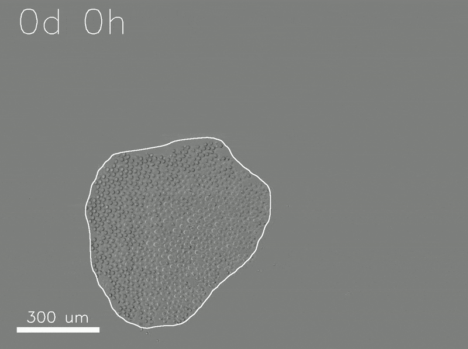
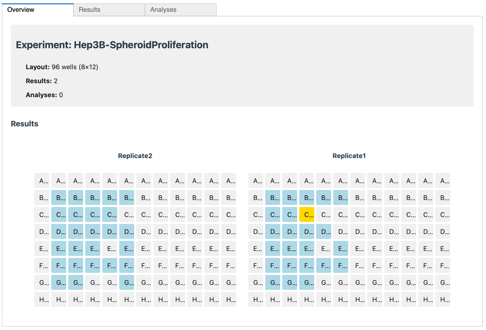
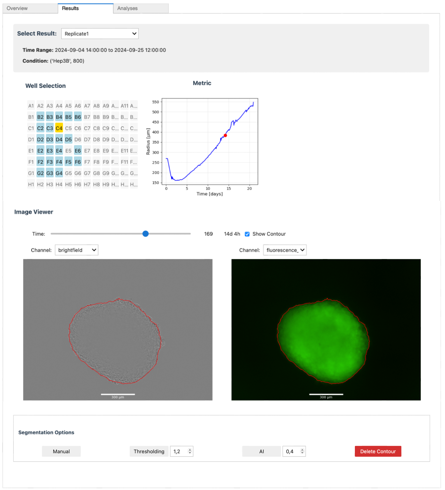
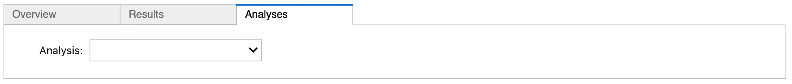

# SpheroidPy
[](https://badge.fury.io/py/SpheroidPy)
[](https://opensource.org/licenses/MIT)

## Overview



`SpheroidPy` is a Python package designed for the management and analysis of _in-vitro_ spheroid data. 
It offers a unified framework with an interface to facilitate the handling, segmentation, and analysis of extensive collections of spheroid microscopy images. 
The package integrates mechanistic biophysical models, including the Greenspan Mathematical Model, enabling users to extract insights into the kinetics of underlying biological processes. 
While primarily developed and optimized for cancer spheroid proliferation and cytotoxicity assays, it can be adapted to other cell entities and three-dimensional assay systems.

## Applications

### Proliferation Assays

<table>
  <tr>
    <td style="text-align: center;">
      
      <p>Plot of Spheroid Growth</p>
    </td>
    <td style="text-align: center;">
      
      <p>Timelapse Video</p>
    </td>
  </tr>
</table>

Proliferation assays are essential for studying growth kinetics in three-dimensional spheroid cultures. Besides simple growth curves, also more complex behaviors - such as the emergence of a necrotic core at a critical size \( $R_c$ \) or saturation at large sizes - can be assessed from such data.
SpheroidPy facilitates data import, spheroid segmentation, and comprehensive analysis of growth dynamics, including automated statistical evaluations.

### Cytotoxity Assays

To be implemented...

## Installation

#### From Source
Alternatively, the package can be installed directly from source. Therefore, this GitHub repository has to be downloaded. 
After navigating to the folder containing package
```bash 
cd path/to/SpheroidPy             # navigate to the parent folder
pip install -r requirements.txt   # install necessary prerequisites
pip install .                     # install the package
```

## Usage
After installation, `SpheroidPy` can be imported and utilized in Python scripts or Jupyter Notebooks. The primary class for organizing and managing data is the `Experiment` class, which can be instantiated as follows:

```python
from SpheroidPy import Experiment
new_experiment = Experiment('ExperimentName', 96, 'path/to/directory')
```
To enhance functionality, additional classes such as `Result`, `Platemap`, `Analysis` and `Visualisation` are provided. A brief overview of their usage is included below, with further details available in the [documentation](https://cedhe.github.io/SpheroidPy/SpheroidPy/docs/build/html/index.html). A short tutorial is available in the [examples](https://cedhe.github.io/SpheroidPy/SpheroidPy/examples) folder.

Alternatively, there is a graphical user interface available. It can be started by running the following command in the terminal:

```bash
cd SpheroidPy/application   # navigate to the application folder
python main.py              # run the application
```

### Results

To be implemented...

### Analyses

To be implemented...

<div style="float: none; display: flex;gap: 20px; justify-content: space-between;">
    <div style="text-align: center;">
        
        <p>Overview Page</p>
    </div>
    <div style="text-align: center;">
        
        <p>Results Page</p>
    </div>
    <div style="text-align: center;">
        
        <p>Analysis Page</p>
    </div>
</div>
Figure: Interactive Visualisation of the obtained Results and Analysis Outcomes
